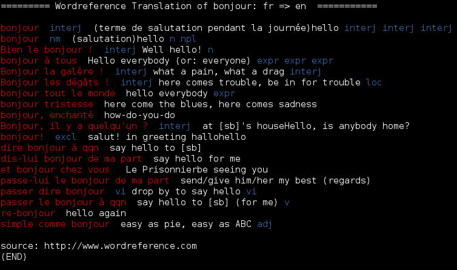

sowordref
=========

wordreference translation in your shell

usage
=========

usage:  
<pre>wordref.py [-h] [-i LANGSOURCE] [-o LANGDESTINATION] word</pre>
 
optional arguments:   
  -i LANGSOURCE  / -o LANGDESTINATION :  
  language source (ex: en) iso 639-1 https://en.wikipedia.org/wiki/List_of_ISO_639-1_codes  
 
 
 
Example:  
 
